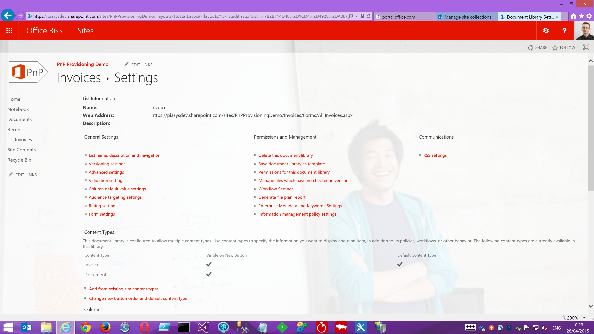
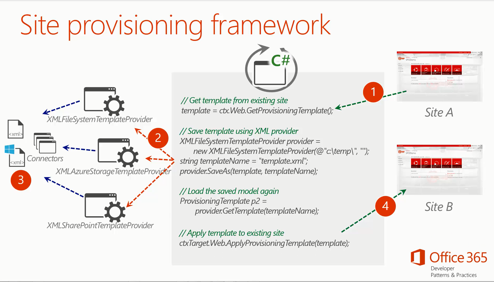
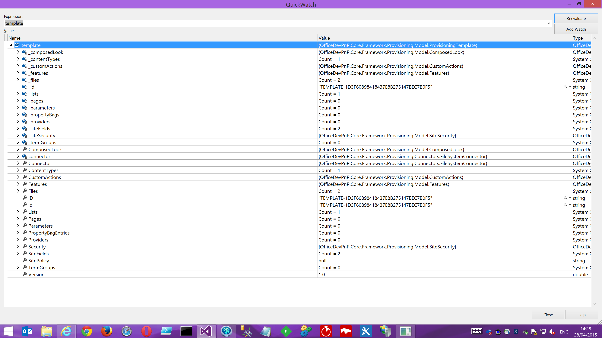
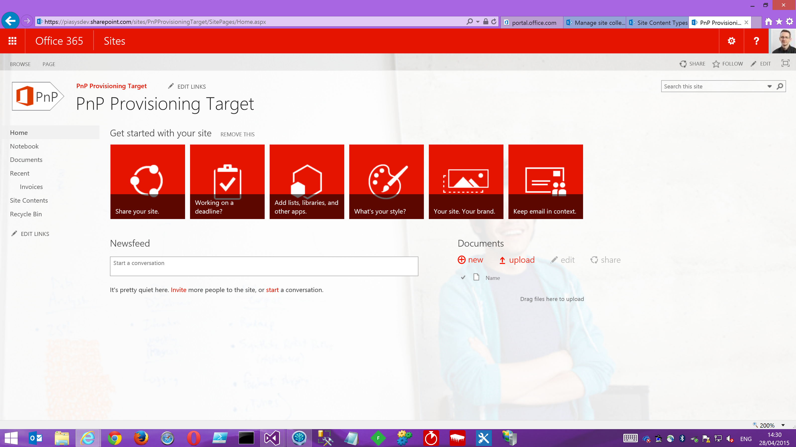

# Introducing the PnP Provisioning Engine

**Author:** Paolo Pialorsi - [www.piasys.com](http://www.piasys.com/) - [@PaoloPia](https://www.twitter.com/PaoloPia/)

_**Applies to:** SharePoint 2013 | SharePoint Online | Office 365_

This short whitepaper introduces the PnP Provisioning Engine, which was released in April 2015 within the [OfficeDev PnP](http://aka.ms/officedevpnp) project, and which will be updated on a monthly basis, in alignment with the release schedule of the Office Dev PnP Core Library. What you will see here is available thanks to the efforts of some of the Office Dev PnP Core Team members ([Vesa Juvonen](https://twitter.com/vesajuvonen), [Bert Jansen](https://twitter.com/O365Bert), [Frank Marasco](https://twitter.com/frank_marasco), [Erwin van Hunen](https://twitter.com/erwinvanhunen), and [me](https://twitter/paolopia)), as well as the whole OfficeDev PnP community.

## The Goal

Let’s start from the main goal of having a provisioning engine. With the introduction of Microsoft Office 365 and Microsoft SharePoint Online, developers are facing the new Cloud Add-in Model (aka CAM) as a new way of creating custom software solutions for Microsoft SharePoint 2013, Microsoft SharePoint Online, and Microsoft Office 365 in general. However, while in the past developers provisioned custom artifacts using the CAML/XML-based features framework, either with Full Trust Code (aka FTC) solutions or Sandbox Solutions, provisioning artifacts in the new CAM model should be done via the "remote provisioning" technique. However, what does it mean to do "remote provisioning"? It means using the Client Side Object Model (CSOM) to provision artifacts, instead of using the feature framework.

What if you want to model and provision artifacts using a test and a production environment, or what if you want to automate provisioning of artifacts, just because you want to sell your customizations to multiple customers? Likewise, what if you want to define a custom site template that you can reuse across multiple site instances, like customer-oriented sites, or project-oriented sites?

Using the new PnP Provisioning Engine, you can model a site by configuring the design of Site Columns, Content Types, List Definitions and Instances, Composed Looks, Pages (either WebPart Pages or Wiki Pages), and much more, via your web browser. When you are done with the design, you can export what you have done into a persistent provisioning template format (XML, JSON, or whatever you like), and you can apply that template to as many target sites as you would like.

If it sounds interesting... keep reading, and let’s learn how to do it!

## Creating a Provisioning Template

As already stated, the easiest way to create a custom provisioning template is to create a fresh new site collection in Microsoft SharePoint Online, configure your artifacts (Composed Look, Site Columns, Content Types, Lists Instances, Pages, Files, etc.) and to save the result as a Provisioning Template.

Thus, let's say you have defined a sample site with a custom look (custom color theme, custom logo, custom background image). You can see the resulting Home Page in the following figure.

Moreover, you have defined a couple of Site Columns, a Content Type and a Library of Invoices with a custom View. In the two following figures you can see the result.

In order to export that site as a Provisioning Template, you can either use PowerShell (thanks to the efforts of [Erwin](https://twitter.com/erwinvanhunen)!) or CSOM code, with some extension methods, which are provided by the OfficeDev PnP Core Library. 

In order to use the PowerShell extensions, you can simply browse to the proper URL ([http://aka.ms/officedevpnpcmdlets16](http://aka.ms/officedevpnpcmdlets16) for Microsoft SharePoint Online, or [http://aka.ms/officedevpnpcmdlets15](http://aka.ms/officedevpnpcmdlets15) for Microsoft SharePoint 2013) and install the OfficeDev PnP Core PowerShell extensions. After you have connected your PowerShell environment to Microsoft Office 365, by using the *Connect-SPOnline* cmdlet, you will be able to use the following PowerShell cmdlet:

*Get-SPOProvisioningTemplate -Out "PnP-Provisioning-File.xml"*

The *–Out* argument instructs the cmdlet about where to save the Provisioning Template.

On the other side, in order to use the CSOM extensions, you can simply create any kind (Console, Windows, SharePoint Add-in, whatever you like) of .NET software project, and add the OfficeDev PnP NuGet Package. The NuGet Package is available in two flavors: OfficeDev PnP Core V15, which targets Microsoft SharePoint 2013 on-premises, and OfficeDev PnP Core, which targets Microsoft SharePoint Online.

Let's target Microsoft SharePoint Online, which has been tested more, and is the main target of the PnP Core Team efforts. You will simply need to connect to Microsoft Office 365, create a *ClientContext* instance and retrieve a reference to a *Web* object. Thanks to a new extension method, called *GetProvisioningTemplate*, you will be able to retrieve a *ProvisioningTemplate* object that can be saved using a template provider and a serialization formatter. Both the template provider and the serialization formatter objects can be customized, so that you can implement whatever persistence storage and serialization format you like. Out of the box, the PnP Provisioning Engine provides support for File System, SharePoint, and Azure Blob Storage template providers, as well as for XML and JSON serialization formatters. In the following figure (credits to [Vesa](https://twitter.com/vesajuvonen)) you can see an outline of the overall architecture of the PnP Provisioning Engine.

The result of extracting and saving a *ProvisioningTemplate* instance object will be for instance an XML file like the one shown in the following XML code excerpt:
    
    <?xml version="1.0"?>
    <pnp:Provisioning xmlns:pnp="http://schemas.dev.office.com/PnP/2015/05/ProvisioningSchema">
      <pnp:Preferences Generator="OfficeDevPnP.Core, Version=1.2.515.0, Culture=neutral, PublicKeyToken=null" />
      <pnp:Templates ID="CONTAINER-TEMPLATE-1D3F60898418437E8B275147BEC7B0F5">
    <pnp:ProvisioningTemplate ID="TEMPLATE-1D3F60898418437E8B275147BEC7B0F5" Version="1">
      <pnp:Security>
    <pnp:AdditionalAdministrators>
      <pnp:User Name="i:0#.f|membership|paolo@piasysdev.onmicrosoft.com" />
    </pnp:AdditionalAdministrators>
      </pnp:Security>
      <pnp:Files>
    <pnp:File Src="PnP.png" Folder="SiteAssets" Overwrite="true" />
    <pnp:File Src="STB13_Rick_01_small.png" Folder="SiteAssets" Overwrite="true" />
      </pnp:Files>
      <pnp:SiteFields>
    <Field Type="DateTime" DisplayName="Invoice Date" Required="FALSE" EnforceUniqueValues="FALSE"
    	Indexed="FALSE" Format="DateOnly" Group="PnP Columns" FriendlyDisplayFormat="Disabled"
    	ID="{f1c6f202-f976-4f4e-b0a3-8b984991d00d}" SourceID="{5a15b9ca-4410-4854-bc61-d7fb0ff84e56}"
    	StaticName="PnPInvoiceDate" Name="PnPInvoiceDate" CalType="0">
      <Default>[today]</Default>
    </Field>
    <Field Type="Text" DisplayName="Invoice Number" Required="FALSE" 
    	EnforceUniqueValues="FALSE" Indexed="FALSE" MaxLength="20" Group="PnP Columns"
    	ID="{5049a822-424c-4479-9648-79c4b3214375}" SourceID="{5a15b9ca-4410-4854-bc61-d7fb0ff84e56}"
    	StaticName="PnPInvoiceNumber" Name="PnPInvoiceNumber">
    </Field>
      </pnp:SiteFields>
      <pnp:ContentTypes>
    <pnp:ContentType ID="0x01010097931365769EE34E9078576A150FF52E" Name="Invoice"
    	Description="" Group="PnP Content Types">
      <pnp:FieldRefs>
    <pnp:FieldRef ID="5049a822-424c-4479-9648-79c4b3214375" Name="PnPInvoiceNumber" />
    <pnp:FieldRef ID="f1c6f202-f976-4f4e-b0a3-8b984991d00d" Name="PnPInvoiceDate" />
      </pnp:FieldRefs>
    </pnp:ContentType>
      </pnp:ContentTypes>
      <pnp:Lists>
    <pnp:ListInstance Title="Invoices" Description=""
    	DocumentTemplate="{site}/Invoices/Forms/template.dotx" TemplateType="101" Url="Invoices"
    	EnableVersioning="true" MinorVersionLimit="0" MaxVersionLimit="500"
    	TemplateFeatureID="00bfea71-e717-4e80-aa17-d0c71b360101" ContentTypesEnabled="true"
    	EnableAttachments="false">
      <pnp:ContentTypeBindings>
    <pnp:ContentTypeBinding ContentTypeID="0x01010097931365769EE34E9078576A150FF52E" Default="true" />
      </pnp:ContentTypeBindings>
      <pnp:Views>
    <View Name="{3D715498-8FA2-4B80-8D35-885B2A4CCBDE}" MobileView="TRUE" MobileDefaultView="TRUE"
    		Type="HTML" DisplayName="All Documents"
    		Url="/sites/PnPProvisioningDemo/Invoices/Forms/AllItems.aspx" Level="1"
    		BaseViewID="1" ContentTypeID="0x" ImageUrl="/_layouts/15/images/dlicon.png?rev=38">
      <Query>
    <OrderBy>
      <FieldRef Name="FileLeafRef" />
    </OrderBy>
      </Query>
      <ViewFields>
    <FieldRef Name="DocIcon" />
    <FieldRef Name="LinkFilename" />
    <FieldRef Name="Modified" />
    <FieldRef Name="Editor" />
      </ViewFields>
      <RowLimit Paged="TRUE">30</RowLimit>
      <JSLink>clienttemplates.js</JSLink>
      <XslLink Default="TRUE">main.xsl</XslLink>
      <Toolbar Type="Standard" />
    </View>
    <View Name="{D9BC935E-2154-47EE-A9E2-7C9490389007}" DefaultView="TRUE" MobileView="TRUE"
    		Type="HTML" DisplayName="All Invoices"
    		Url="/sites/PnPProvisioningDemo/Invoices/Forms/All Invoices.aspx" Level="1"
    		BaseViewID="1" ContentTypeID="0x" ImageUrl="/_layouts/15/images/dlicon.png?rev=38">
      <Query>
    <OrderBy>
      <FieldRef Name="FileLeafRef" />
    </OrderBy>
      </Query>
      <ViewFields>
    <FieldRef Name="DocIcon" />
    <FieldRef Name="LinkFilename" />
    <FieldRef Name="Modified" />
    <FieldRef Name="Editor" />
    <FieldRef Name="PnPInvoiceDate" />
    <FieldRef Name="PnPInvoiceNumber" />
      </ViewFields>
      <RowLimit Paged="TRUE">30</RowLimit>
      <Aggregations Value="Off" />
      <JSLink>clienttemplates.js</JSLink>
      <XslLink Default="TRUE">main.xsl</XslLink>
      <Toolbar Type="Standard" />
    </View>
      </pnp:Views>
      <pnp:FieldRefs>
    <pnp:FieldRef ID="5049a822-424c-4479-9648-79c4b3214375" Name="PnPInvoiceNumber"
    		DisplayName="Invoice Number" />
    <pnp:FieldRef ID="f1c6f202-f976-4f4e-b0a3-8b984991d00d" Name="PnPInvoiceDate"
    		DisplayName="Invoice Date" />
      </pnp:FieldRefs>
    </pnp:ListInstance>
      </pnp:Lists>
      <pnp:Features />
      <pnp:CustomActions />
      <pnp:ComposedLook
    BackgroundFile="{sitecollection}/SiteAssets/STB13_Rick_01_small.png"
    ColorFile="{sitecollection}/_catalogs/theme/15/Palette012.spcolor"
    SiteLogo="{sitecollection}/SiteAssets/PnP.png"
    Name="RED"
    MasterPage="{sitecollection}/_catalogs/masterpage/seattle.master"
    FontFile="" />
    </pnp:ProvisioningTemplate>
      </pnp:Templates>
    </pnp:Provisioning>
    

As you can see, the XML elements are fairly self-explanatory. The XML schema used in the example references the 201505 version of the PnP Provisioning Schema (XML Namespace: *http://schemas.dev.office.com/PnP/2015/05/ProvisioningSchema*), which has been defined together with the OfficeDev PnP Community, and which can be found on GitHub at the following URL: [https://github.com/SharePoint/Pnp-Provisioning-Schema/](https://github.com/SharePoint/Pnp-Provisioning-Schema/). Within the same repository, you will also find a markdown (MD) auto-generated document, which describes the main elements, types, and attributes available to manually define an XML provisioning template.

However, the real power of this provisioning engine is the availability of a high-level, serialization format that is independent of the Domain Model. In fact, internally the PnP Provisioning Engine is completely decoupled from any kind of serialization format, and the whole engine simply handles instances of the *ProvisioningTemplate* type. For instance, in the following figure you can see the "Quick Watch" window of Microsoft Visual Studio 2013 showing a ProvisioningTemplate object instance.

It is up to you to define the *ProvisioningTemplate* manually, using a model site, or by composing an XML document that validates against the PnP Provisioning XSD Schema, or by simply writing .NET code and constructing the hierarchy of objects. You can even do a mix of these approaches: you can design the provisioning template using a model site, save it into an XML file, and do some in-memory customizations, while handling the *ProvisioningTemplate* instance in your code.

## Applying a Provisioning Template

Now that you have seen what a Provisioning Template is, and how to extract the Domain Model object from an existing site, you are ready to apply it to a target site. Let's say that you have another fresh new Site Collection in Microsoft SharePoint Online that has been created using the Team Site template, like it is shown in the following figure.
 

By default, the site will look like the following figure, which is the default layout of a SharePoint Online site.

You can now apply a custom *ProvisioningTemplate* instance object either by utilizing PowerShell, or by writing .NET code. If you want to use PowerShell, the following excerpt shows how you can utilize the *Apply-SPOProvisioningTemplate* cmdlet.

*Apply-SPOProvisioningTemplate -Path "PnP-Provisioning-File.xml"*

The *–Path* argument refers to the source template file, which the cmdlet will automatically apply to the currently connected site (implied by the *Connect-SPOnline* cmdlet). In the following figure you can see the final result.

As you can see, the site has the same look as the original template, and it includes the Invoices library, with all of the same underlying structure and configuration (Site Columns, Content Types, etc.).

What about using .NET code? Here is an excerpt on how to use CSOM and the OfficeDev PnP Core Library extension methods to apply the template.

    using (var context = new ClientContext(destinationUrl))
    {
      context.Credentials = new SharePointOnlineCredentials(userName, password);
      Web web = context.Web;
      context.Load(web, w => w.Title);
      context.ExecuteQueryRetry();
    
      // Configure the XML file system provider
      XMLTemplateProvider provider =
      new XMLFileSystemTemplateProvider(
        String.Format(@"{0}\..\..\",
        AppDomain.CurrentDomain.BaseDirectory),
        "");
    
      // Load the template from the XML stored copy
      ProvisioningTemplate template = provider.GetTemplate(
        "PnP-Provisioning-Demo-201505-Polished.xml");
    
      // Apply the template to another site
      Console.WriteLine("Start: {0:hh.mm.ss}", DateTime.Now);
    
      // We can also use Apply-SPOProvisioningTemplate
      web.ApplyProvisioningTemplate(template);
     
      Console.WriteLine("End: {0:hh.mm.ss}", DateTime.Now);
    }
    
To start, you need to create an instance of a Template Provider object, depending on what kind of persistence you will use to save and load the template.  Next, you load the template from the source repository, by using the *GetTemplate* method. Lastly, you will apply the template to the target site, using the *ApplyProvisioningTemplate* extension method of the Web type.

On average, the library will take a couple of minutes to apply the template, regardless of whether you are utilizing PowerShell or .NET code. If desired, you can register a delegate to monitor the overall process, while the provisioning is in progress. We are still improving performances of the engine, and so far we have focused our attention on capabilities and functionalities.

## Advanced Topics

This is just an introductory article, as in the near future we will go deeper around some more advanced topics. Nevertheless, it is important to understand that using the new PnP Provisioning Engine, you can also provision Taxonomies, as well as use variables and tokens, which can be replaced at runtime, based on what you are provisioning (List IDs, Parameters, Term IDs, etc.). You can invoke the provisioning engine from timer job services, provider-hosted add-ins, external sites, and more. Lastly, you can use the PnP Provisioning Engine to move artifacts from test/staging environments to production environments.

Moreover, on Channel 9 there is a [section dedicated to OfficeDev PnP](http://aka.ms/OfficeDevPnPVideos), where you can watch some videos about the PnP Provisioning Engine and the PnP PowerShell Extensions:

- [Getting Started with PnP Provisioning Engine](https://channel9.msdn.com/blogs/OfficeDevPnP/Getting-Started-with-PnP-Provisioning-Engine)
- [Deep dive to PnP provisioning engine schema](https://channel9.msdn.com/blogs/OfficeDevPnP/Deep-dive-to-PnP-provisioning-engine-schema)
- [Introduction to PnP PowerShell Cmdlets](https://channel9.msdn.com/blogs/OfficeDevPnP/Introduction-to-PnP-PowerShell-Cmdlets)

## Requirements and Wrap Up ##

In order to play with the PnP Provisioning Engine on-premises, you need to have at least the SharePoint 2013 March 2015 Cumulative Update installed, as the engine leverages some [new capabilities](http://blogs.msdn.com/b/vesku/archive/2015/04/10/new-sharepoint-csom-version-released-for-office-365.aspx) of the Client Side Object Model, which are not available in previous versions of the product. If you target Microsoft SharePoint Online, the requirements are automatically satisfied thanks to the Software as a Service model.

Please, play with the PnP Provisioning Engine, give us feedback, and enjoy the future of the SharePoint Add-in Model and remote provisioning!

## Additional resources

-  [Office 365 Development Patterns & Practices on GitHub](https://github.com/SharePoint/PnP/)
-  [SharePoint Developer Group](http://aka.ms/sppnp-community) at Microsoft Tech Community
