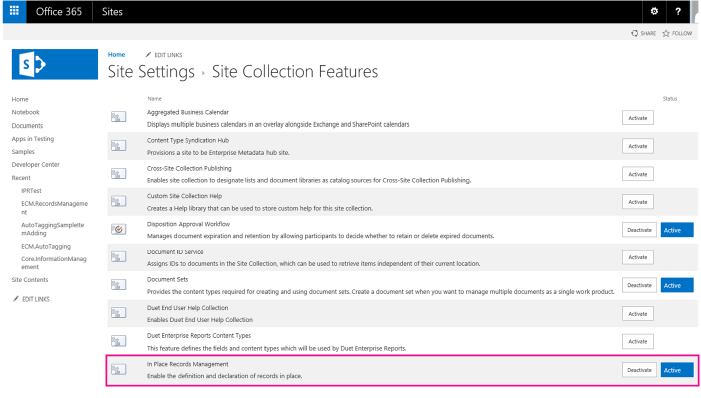
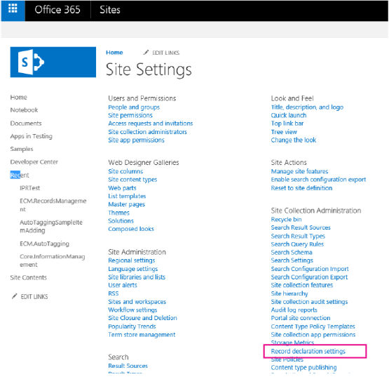
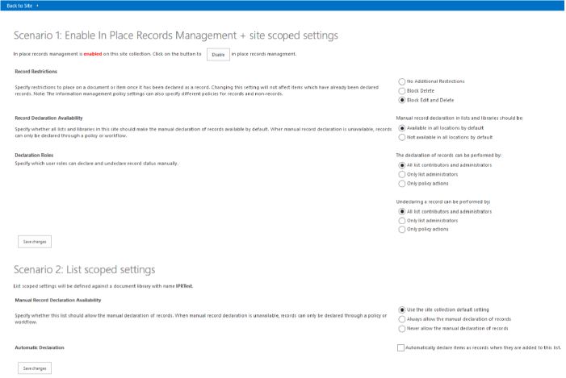

# Records management extensions sample app for SharePoint

As part of your Enterprise Content Management (ECM) strategy, you can enable and change in-place records management settings on your SharePoint sites and lists.

_**Applies to:** Office 365 | SharePoint 2013 | SharePoint Online_

The [ECM.RecordsManagement](https://github.com/SharePoint/PnP/tree/master/Samples/ECM.RecordsManagement) sample shows you how to use a provider-hosted SharePoint app to control the in-place records management settings for a site or list.    

Use this solution if you want to:

- Configure in-place records management settings during your custom site provisioning process.
 
## Before you begin
<a name="sectionSection0"> </a>

To get started, download the  [ECM.RecordsManagement](https://github.com/SharePoint/PnP/tree/master/Samples/ECM.RecordsManagement) sample app from the [Office 365 Developer patterns and practices](https://github.com/SharePoint/PnP/tree/dev) project on GitHub.

Before you run this app:

- Activate the In-Place Records Management feature on the site collection, as shown in Figure 1.
    
    **Figure 1. Activating In-Place Records Management on your site collection**

    

- In site settings, verify that you see  **Record declaration settings** in **Site Collection Administration**, as shown in Figure 2.
    
    **Figure 2. Record declaration settings in Site Settings**

    

## Using the ECM.RecordsManagement sample app
<a name="sectionSection1"> </a>

 When you start the app, the start page displays the two scenarios that are available:

- Enabling in-place records management for sites
    
- Enabling in-place records management for lists

**Figure 3. ECM.RecordsManagement app start page**

 

You can use scenario 1 to build a UI to control the records management settings on your site collection. The UI in this app is similar to the UI found in **Records declaration settings** in **Site Settings** (see Figure 2). You can also activate or deactivate the In-Place Records Management feature on your site collection.

You can use Scenario 2 to build a UI to control the records management settings on lists. The UI in this app is similar to the UI found in  **Records declaration settings** in the library settings on your list.

**Figure 4. Record declaration settings on a list**


### Scenaro 1

Scenario 1 addresses in-place records management features and settings for sites. The app UI includes a  **Deactivate** (or **Activate**) button, as shown in Figure 5. Choosing this button deactivates (or activates) the In-Place Records Management feature on the site collection. 

**Figure 5. Deactivate button for the In-Place Records Management feature**


The following code activates or deactivates the In-Place Records Management feature on the site collection. The  **DisableInPlaceRecordsManagementFeature** and **EnableSiteForInPlaceRecordsManagement** methods are part of the AppModelExtensions\RecordsManagementExtensions.cs file in the [OfficeDevPnP.Core](https://github.com/SharePoint/PnP/tree/master/OfficeDevPnP.Core).
    
**Note**  The code in this article is provided as-is, without warranty of any kind, either express or implied, including any implied warranties of fitness for a particular purpose, merchantability, or non-infringement.

```C#
protected void btnToggleIPRStatus_Click(object sender, EventArgs e)
        {
            if (cc.Site.IsInPlaceRecordsManagementActive())
            {
                cc.Site.DisableInPlaceRecordsManagementFeature();
                IPRStatusUpdate(false);
            }
            else
            {
                cc.Site.EnableSiteForInPlaceRecordsManagement();
                IPRStatusUpdate(true);
            }
        }
```

OfficeDevPnP.Core includes extension methods to get and set all site-scoped in-place records management settings. The following code from the  **EnableSiteForInPlaceRecordsManagement** method shows how to use these extension methods to set restrictions, and specify who can declare or undeclare records on your site.

```C#
public static void EnableSiteForInPlaceRecordsManagement(this Site site)
        {
            // Activate the In-Place Records Management feature if not yet enabled.
            if (!site.IsFeatureActive(new Guid(INPLACE_RECORDS_MANAGEMENT_FEATURE_ID)))
            {
                // Note: this also sets the ECM_SITE_RECORD_RESTRICTIONS value to "BlockDelete, BlockEdit".
                site.ActivateInPlaceRecordsManagementFeature();
            }

            // Enable in-place records management in all locations.
            site.SetManualRecordDeclarationInAllLocations(true);

            // Set restrictions to default values after enablement (this is also done at feature activation).
            EcmSiteRecordRestrictions restrictions = EcmSiteRecordRestrictions.BlockDelete | EcmSiteRecordRestrictions.BlockEdit;
            site.SetRecordRestrictions(restrictions);

            // Set record declaration to default value.
            site.SetRecordDeclarationBy(EcmRecordDeclarationBy.AllListContributors);

            // Set record undeclaration to default value.
            site.SetRecordUnDeclarationBy(EcmRecordDeclarationBy.OnlyAdmins);

        }
```

When the user changes their in-place records management settings and chooses the  **Save changes** button, the following code in the **btnSaveSiteScopedIPRSettings_Click** method runs.

```C#
protected void btnSaveSiteScopedIPRSettings_Click(object sender, EventArgs e)
        {
            EcmSiteRecordRestrictions restrictions = (EcmSiteRecordRestrictions)Convert.ToInt32(rdRestrictions.SelectedValue);
            cc.Site.SetRecordRestrictions(restrictions);
            cc.Site.SetManualRecordDeclarationInAllLocations(Convert.ToBoolean(rdAvailability.SelectedValue));
            EcmRecordDeclarationBy declareBy = (EcmRecordDeclarationBy)Convert.ToInt32(rdDeclarationBy.SelectedValue);
            cc.Site.SetRecordDeclarationBy(declareBy);
            EcmRecordDeclarationBy unDeclareBy = (EcmRecordDeclarationBy)Convert.ToInt32(rdUndeclarationBy.SelectedValue);
            cc.Site.SetRecordUnDeclarationBy(unDeclareBy);
        }
```

In the previous code, a call is made to the  **SetRecordRestrictions** method in RecordsManagementExtensions.cs. The **SetRecordRestrictions** method in the next example shows how to set restrictions on the records.

```C#
public static void SetRecordRestrictions(this Site site, EcmSiteRecordRestrictions restrictions)
        {
            string restrictionsProperty = "";

            if (restrictions.Has(EcmSiteRecordRestrictions.None))
            {
                restrictionsProperty = EcmSiteRecordRestrictions.None.ToString();
            }
            else if (restrictions.Has(EcmSiteRecordRestrictions.BlockEdit))
            {
                // BlockEdit is always used in conjunction with BlockDelete.
                restrictionsProperty = EcmSiteRecordRestrictions.BlockDelete.ToString() + ", " + EcmSiteRecordRestrictions.BlockEdit.ToString();
            }
            else if (restrictions.Has(EcmSiteRecordRestrictions.BlockDelete))
            {
                restrictionsProperty = EcmSiteRecordRestrictions.BlockDelete.ToString();
            }

            // Set property bag entry.
            site.RootWeb.SetPropertyBagValue(ECM_SITE_RECORD_RESTRICTIONS, restrictionsProperty);
        }
```

### Scenario 2

Scenario 2 shows how to interact with in-place records management settings for lists. When the app installs, it creates a document library called IPRTest. When you use this app to change and save the in-place records management settings, the changes are applied to IPRTest. 

**Note**  To use in-place records management settings on a list, you must activate the In-place Records Management feature on your site collection, as shown in Figure 1 earlier in this article. 

The following code in Default.aspx.cs runs when a user chooses the  **Save Changes** button.

```C#
protected void btnSaveListScopedIPRSettings_Click(object sender, EventArgs e)
        {
            List ipr = cc.Web.GetListByTitle(IPR_LIBRARY);
            EcmListManualRecordDeclaration listManual = (EcmListManualRecordDeclaration)Convert.ToInt32(rdListAvailability.SelectedValue);
            ipr.SetListManualRecordDeclaration(listManual);
            ipr.SetListAutoRecordDeclaration(chbAutoDeclare.Checked);

            // Refresh the settings as AutoDeclare changes the manual settings.
            if (ipr.IsListRecordSettingDefined())
            {
                rdListAvailability.SelectedValue = Convert.ToString((int)ipr.GetListManualRecordDeclaration());
                chbAutoDeclare.Checked = ipr.GetListAutoRecordDeclaration();
                rdListAvailability.Enabled = !chbAutoDeclare.Checked;
            }

        }
```

The code calls the following two methods in the RecordsManagementExtensions.cs file of OfficeDevPnP.Core:

-  **SetListManualRecordDeclaration** - Defines the manual records declaration setting for this list.
    
-  **SetListAutoRecordDeclaration** - Automatically declares items added to this list as a record. If records declaration is set to automatic on this list, the manual records declaration settings on the list no longer apply. Event receivers are added to the list to start specific records management actions when events occur.

```C#
public static void SetListManualRecordDeclaration(this List list, EcmListManualRecordDeclaration settings)
        {
            if (settings == EcmListManualRecordDeclaration.UseSiteCollectionDefaults)
            {
                // If you set list record declaration back to the default values, you also need to 
                // turn off auto record declaration. Other property bag values are left as is; when 
                // settings are changed again these properties are also again usable.
                if (list.PropertyBagContainsKey(ECM_AUTO_DECLARE_RECORDS))
                {
                    list.SetListAutoRecordDeclaration(false);
                }
                // Set the property that dictates custom list record settings to false.
                list.SetPropertyBagValue(ECM_IPR_LIST_USE_LIST_SPECIFIC, false.ToString());
            }
            else if (settings == EcmListManualRecordDeclaration.AlwaysAllowManualDeclaration)
            {
                list.SetPropertyBagValue(ECM_ALLOW_MANUAL_DECLARATION, true.ToString());
                // Set the property that dictates custom list record settings to true.
                list.SetPropertyBagValue(ECM_IPR_LIST_USE_LIST_SPECIFIC, true.ToString());
            } 
            else if (settings == EcmListManualRecordDeclaration.NeverAllowManualDeclaration)
            {
                list.SetPropertyBagValue(ECM_ALLOW_MANUAL_DECLARATION, false.ToString());
                // Set the property that dictates custom list record settings to true.
                list.SetPropertyBagValue(ECM_IPR_LIST_USE_LIST_SPECIFIC, true.ToString());
            }
            else
            {
                throw new ArgumentOutOfRangeException("settings");
            }
        }

public static void SetListAutoRecordDeclaration(this List list, bool autoDeclareRecords)
        {
            // Determine the SharePoint version based on the loaded CSOM library.
            Assembly asm = Assembly.GetAssembly(typeof(Microsoft.SharePoint.Client.Site));
            int sharePointVersion = asm.GetName().Version.Major;

            if (autoDeclareRecords)
            {
                // Set the property that dictates custom list record settings to true.
                list.SetPropertyBagValue(ECM_IPR_LIST_USE_LIST_SPECIFIC, true.ToString());
                // Prevent manual declaration.
                list.SetPropertyBagValue(ECM_ALLOW_MANUAL_DECLARATION, false.ToString());

                // Hook up the needed event handlers.
                list.Context.Load(list.EventReceivers);
                list.Context.ExecuteQuery();

                List<EventReceiverDefinition> currentEventReceivers = new List<EventReceiverDefinition>(list.EventReceivers.Count);
                currentEventReceivers.AddRange(list.EventReceivers);

                // Track changes to see if a list.Update is needed.
                bool eventReceiverAdded = false;
                
                // ItemUpdating receiver.
                EventReceiverDefinitionCreationInformation newEventReceiver = CreateECMRecordEventReceiverDefinition(EventReceiverType.ItemUpdating, 1000, sharePointVersion);
                if (!ContainsECMRecordEventReceiver(newEventReceiver, currentEventReceivers))
                {
                    list.EventReceivers.Add(newEventReceiver);
                    eventReceiverAdded = true;
                }
                // ItemDeleting receiver.
                newEventReceiver = CreateECMRecordEventReceiverDefinition(EventReceiverType.ItemDeleting, 1000, sharePointVersion);
                if (!ContainsECMRecordEventReceiver(newEventReceiver, currentEventReceivers))
                {
                    list.EventReceivers.Add(newEventReceiver);
                    eventReceiverAdded = true;
                }
                // ItemFileMoving receiver.
                newEventReceiver = CreateECMRecordEventReceiverDefinition(EventReceiverType.ItemFileMoving, 1000, sharePointVersion);
                if (!ContainsECMRecordEventReceiver(newEventReceiver, currentEventReceivers))
                {
                    list.EventReceivers.Add(newEventReceiver);
                    eventReceiverAdded = true;
                }
                // ItemAdded receiver.
                newEventReceiver = CreateECMRecordEventReceiverDefinition(EventReceiverType.ItemAdded, 1005, sharePointVersion);
                if (!ContainsECMRecordEventReceiver(newEventReceiver, currentEventReceivers))
                {
                    list.EventReceivers.Add(newEventReceiver);
                    eventReceiverAdded = true;
                }
                // ItemUpdated receiver.
                newEventReceiver = CreateECMRecordEventReceiverDefinition(EventReceiverType.ItemUpdated, 1007, sharePointVersion);
                if (!ContainsECMRecordEventReceiver(newEventReceiver, currentEventReceivers))
                {
                    list.EventReceivers.Add(newEventReceiver);
                    eventReceiverAdded = true;
                }
                // ItemCheckedIn receiver.
                newEventReceiver = CreateECMRecordEventReceiverDefinition(EventReceiverType.ItemCheckedIn, 1006, sharePointVersion);
                if (!ContainsECMRecordEventReceiver(newEventReceiver, currentEventReceivers))
                {
                    list.EventReceivers.Add(newEventReceiver);
                    eventReceiverAdded = true;
                }
                                
                if (eventReceiverAdded)
                {
                    list.Update();
                    list.Context.ExecuteQuery();
                }

                // Set the property that dictates the autodeclaration.
                list.SetPropertyBagValue(ECM_AUTO_DECLARE_RECORDS, autoDeclareRecords.ToString());
            }
            else
            {
                // Set the property that dictates the autodeclaration.
                list.SetPropertyBagValue(ECM_AUTO_DECLARE_RECORDS, autoDeclareRecords.ToString());
                //Note: Existing list event handlers will just stay as they are, no need to remove them.
            }
        }
```

## Additional resources
<a name="bk_addresources"> </a>

-  [Enterprise Content Management solutions for SharePoint 2013 and SharePoint Online](Enterprise-Content-Management-solutions-for-SharePoint-2013-and-SharePoint-Online.md)
    
-  [OfficeDevPnP.Core sample](https://github.com/SharePoint/PnP-Sites-Core/tree/master/Core)
