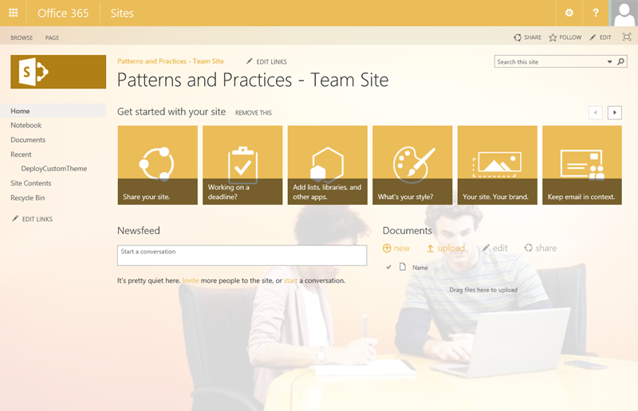
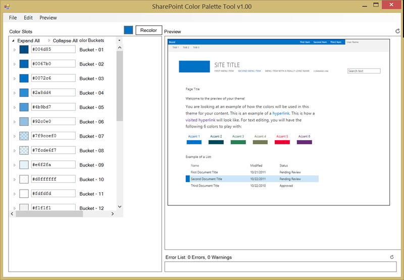

# Branding SharePoint sites in the SharePoint Add-in model

## Summary

The approach you take to brand SharePoint sites is different in the new SharePoint Add-in model than it was with Full Trust Code / Farm Solutions.  In a typical Full Trust Code (FTC) / Farm Solution branding scenario, custom master pages, web templates, JavaScript, CSS files, and images are created to implement a custom brand.  Additionally, SharePoint themes and composed looks may be created to implement a custom brand.  These artifacts are typically packaged in a feature that uses declarative code and FTC / Farm Solution to deploy the assets and register them with the SharePoint site.

In a SharePoint Add-in model branding scenario, all of the options associated with FTC / Farm Solution branding scenarios are available.  No matter which option you choose, you can deploy and register your branding assets on SharePoint sites via the remote-provisioning pattern.

> [!IMPORTANT] 
> This extensibility option is **only** available for classic SharePoint experiences. You cannot use this option with modern experiences in SharePoint Online, like with communication sites. Notice also that you should **not** take a dependency on the html page structure or on the out-of-the-box CSS style names as these might be adjusted without a notice.

## Terminology

This article uses the term **SharePoint theme**, which has overloaded meanings in other articles on MSDN, MS Blogs, and all across the Internet.  In MSDN terminology, **SharePoint theme** specifically refers to the color palette / color scheme (.spcolor file) applied to a SharePoint site.  In PnP terminology, the terms **SharePoint theme** and **composed look** are the same thing.

A SharePoint theme is one of many [SharePoint theming experience components](https://msdn.microsoft.com/library/office/jj927174.aspx).

In this article we chose to align the term **SharePoint theme** with the specific technical item it refers to in order to succinctly describe all your branding options. 

## Why would you custom brand a SharePoint site?

There are many different reasons why you would apply custom branding to a SharePoint site.  These reasons can include corporate identity, usability, marketing, etc.  

As a rule of a thumb, we would like to provide the following high-level guidelines for custom branding SharePoint sites

- Use Office 365 themes, SharePoint site theming experience components, and composed looks to apply branding to SharePoint sites whenever possible.
- You can adjust some CSS settings using the alternate CSS option if the themes do not support your requirements.
- You can use JavaScript embedding to modify or hide elements of a SharePoint site.
- You can customize SharePoint sites using custom master pages, but keep in mind this will cause you additional long-term costs and challenges with future updates.
	+ In most cases, you can achieve all common branding scenarios with themes, composed looks, and alternate CSS.
	+ If you chose to use custom master pages, be prepared to apply changes to the custom master pages when major functional updates are applied to Office 365.
- Use remote provisioning to deploy and register themes, composed looks, and all branding artifacts with SharePoint sites.
- Do not use declarative code or sandbox code to deploy and register themes, master pages, and other branding artifacts with SharePoint sites.  

In summary, Office 365 SharePoint sites support customized branding. This article will help you consider the short and long-term impact of customization from an operational and a maintenance perspective. This is not really specific for SharePoint; but is rather a rule of thumb for any IT solution built with any platform.

Here’s an example of an Office 365 SharePoint site, which has been customized using the guidelines above. In this case the custom branding has been implemented with an Office 365 theme, deployed, and registered with a SharePoint site via the remote provisioning pattern with the SharePoint CSOM API.

This example comes from the [Theme management using CSOM (O365 PnP Sample)](https://github.com/SharePoint/PnP/tree/master/Samples/Branding.DeployCustomThemeWeb).



## Challenges applying brand customization to SharePoint sites

**Office 365 themes vs. SharePoint themes**

It is important to understand that Office 365 themes and SharePoint themes are different.  It is also important to understand SharePoint themes and composed looks are used to brand SharePoint sites.  This list describes the different items.  

- **Office 365 themes** are used to brand the top navigation bar in an Office 365 tenancy.  They are only supported in Office 365 SharePoint sites, not on-premises.
- **SharePoint themes** apply colors to your SharePoint sites.
- **Composed looks** apply colors, fonts, master pages, and background images to your SharePoint sites. 

**Office 365 themes** contain the components listed below.  

- custom logo
- url for custom logo
- background image
- base color
- accent color
- nav bar background color
- text and icons color
- app menu icon

See the [Customize the Office 365 theme for your organization](https://support.office.com/en-au/article/Customize-the-Office-365-theme-for-your-organization-8275da91-7a48-4591-94ab-3123a3f79530) article to learn more about Office 365 themes.

**SharePoint themes** include the following components.  

- color palette (.spcolor file)

*Notice a SharePoint theme in an Office 365 SharePoint site does not include a master page, master page preview, or composed look.* This aligns with the guidance mentioned above to not use custom master pages to implement branding on SharePoint sites.

**Composed looks used for on-premises SharePoint 2013/2016 sites** include one or more of the following components.  

- color palette (.spcolor file) - Also referred to as a SharePoint theme
- font scheme (.spfont file)
- background image
- master page
- master page preview

See the [Themes overview for SharePoint 2013](https://msdn.microsoft.com/library/office/jj927174.aspx) article to learn more about these components.

**Composed looks used for Office 365 SharePoint sites** include one or more of the following components.  

- color palette (.spcolor file) - Also referred to as a SharePoint theme
- font scheme (.spfont file)
- background image
- master page

**Team sites vs. Publishing sites**

When applying custom branding to SharePoint sites you will encounter the need to brand both team sites and publishing sites. Generally speaking, intranets built on SharePoint in both on-premises and Office 365 scenarios use a combination of team sites and publishing sites.  

Custom branding requirements often times require specific layout changes that themes and JavaScript embedding techniques cannot accomplish.

In such a scenario, team sites usually do not require the amount of custom branding that publishing sites do and the out-of-the-box SharePoint Contemporary View for mobile devices is usually sufficient to support mobile devices for team sites.  Since this is the case, it is best to only use custom master pages for publishing sites and to use custom SharePoint themes (.spcolor files), font schemes (.spfont files), and background images defined as composed looks to brand team sites.

**Deployment**

Custom branding is typically applied when a site is provisioned.  The remote provisioning process fits very well with this approach.  Usually the only time you will use the web browser to manually apply SharePoint branding customization is when you are prototyping or modifying a single SharePoint site that is not planned to grow to include other site collections or sub sites. 

## Options to apply brand customization to SharePoint sites

You can choose from several options to apply brand customization to SharePoint sites with the new SharePoint Add-in model.

- Use an Office 365 theme to brand a SharePoint site.
- Change the composed look for a SharePoint site.
- Use the SharePoint color palette tool to create a color palette for a SharePoint theme.
- Use Alternate CSS to brand a SharePoint site.
- Create a color scheme for a SharePoint theme manually. 
- Create a font scheme for a SharePoint theme manually.
- Use JavaScript embedding to show and hide components on a SharePoint site.
- Create custom master pages and page layouts for a SharePoint site.
- Create a composed look for a SharePoint site.

## Use an Office 365 theme to brand a SharePoint site

Changing an O365 tenancy's Office theme is the easiest way to apply branding to a SharePoint site.

- Office 365 themes can be used to centrally control branding across all Office 365 services.
	+ Currently, the number of settings associated with an Office 365 theme is limited.
- Office 365 themes may be overridden at the SharePoint site level.
- Office 365 themes only exist in Office 365 tenants, not in on-premises SharePoint.
- Office 365 themes provide a fair amount of flexibility to brand a SharePoint site.
- Office 365 themes are very easy and inexpensive to implement and maintain in the short and long term.

**When is using an Office 365 theme to brand a SharePoint site a good fit?**

This option works well when your branding needs are not very specific and you are just looking for a new color scheme for the Office bar portion of your SharePoint site, a logo, and a background image.  ***It is important to note that the only way to change the App Menu icon is via the Office 365 theme.***

**Recommended deployment approaches**

You can change the Office 365 theme for an Office 365 tenancy via the web browser or the remote provisioning pattern.

## Change the composed look for a SharePoint site

Changing a SharePoint site's composed look is another easy way to apply branding to a SharePoint site.  

- Composed looks are accessed in the Site Settings page.  
- SharePoint ships with several composed looks to choose from.
- Composed looks exist in both Office 365 tenants and in on-premises SharePoint.
- Composed looks provide a fair amount of flexibility to brand a SharePoint site.
	+ Remember, composed looks are collections of color and font schemes, a background image, and a master page.
- Composed looks are very easy and inexpensive to implement in the short and long term.
- Composed looks can include out-of-the-box master pages, or custom master pages.
- You can use composed looks at a per-site level.
 
**When is changing a composed look for a SharePoint site a good fit?**

This option works well when your branding needs are not very specific and you are just looking for a new color scheme, background image, and a master page for your site.

**Recommended deployment approaches**

You can change the composed look for a SharePoint site via the web browser or the remote provisioning pattern.

## Use the SharePoint color palette tool to create a color palette for a SharePoint theme

The [SharePoint color palette tool](https://www.microsoft.com/en-gb/download/details.aspx?id=38182) (pictured below) is easy to use and allows you to create the color scheme for a SharePoint theme.  This tool provides a *what you see is what you get* editing experience.  When you save the color schemes this tool creates it generates a .spcolor file.



- Creating custom color schemes for SharePoint sites is very easy and inexpensive to implement and maintain in the short and long term.
	+ Keep in mind, a custom color scheme is just one piece of a composed look.
- Custom color schemes provide a fair amount of flexibility to brand a SharePoint site.
- You can apply color schemes via composed looks at a per site level.

**When is creating custom color scheme for SharePoint sites a good fit?**

This option works well when your branding needs include a new color scheme but do not require layout changes or showing and hiding various Office 365 SharePoint components.

**Recommended deployment approaches**

You can use the web browser or the remote provisioning pattern to upload the .spcolor file the tool creates to a SharePoint site, create a composed look that includes it, and apply it to a SharePoint site.

## Use alternate CSS to brand a SharePoint site

You can also create a custom cascading style sheet (CSS) file and set it as the alternate CSS file for a SharePoint site.  

- Alternate CSS may be used to override the out-of-the-box CSS settings that come with SharePoint.
- You can use the alternate CSS approach to control to color, fonts and even layout settings. 
- Alternate CSS requires a medium amount of investment to implement and maintain in the short and long term.
- Alternate CSS provides a good amount of flexibility to brand a SharePoint site.
- You can use alternate CSS at a per-site level.

**When is using alternate CSS to brand a SharePoint site a good fit?**

This option works well when your branding needs include a new color scheme, fonts, and require minimal layout changes but do not include showing and hiding various Office 365 SharePoint components.

**Recommended deployment approach**

You can use the web browser or the remote provisioning pattern to upload a CSS file to a SharePoint site and apply it to a SharePoint site.

## Create a color scheme for a SharePoint theme manually

You can also create a .spcolor file manually with a text editor such as Notepad or Visual Studio.  You can see an example snippet from a .spcolor file is shown below.

```XML
<?xml version="1.0" encoding="utf-8"?>
<s:colorPalette isInverted="false" previewSlot1="BackgroundOverlay" previewSlot2="BodyText" previewSlot3="AccentText" xmlns:s="http://schemas.microsoft.com/sharepoint/">
<s:color name="BodyText" value="444444" />
<s:color name="SubtleBodyText" value="777777" />
<s:color name="StrongBodyText" value="262626" />
```

- Creating custom color schemes for SharePoint sites is very easy and inexpensive to implement and maintain in the short and long term.
	+ Keep in mind, a custom color scheme is just one piece of a composed look.
- Custom color schemes provide a fair amount of flexibility to brand a SharePoint site.
- You can apply color schemes via composed looks at a per-site level.
 
**When is manually creating a color scheme for A SharePoint site a good fit?**

This option works well when your branding needs include a new color scheme but do not require layout changes or showing and hiding various Office 365 SharePoint components.

**Recommended deployment approaches**

You can use the web browser or the remote provisioning pattern to upload the .spcolor file the tool creates to a SharePoint site.

## Create a font scheme for a SharePoint theme manually

You can also define the fonts your SharePoint site uses by making a font scheme for your SharePoint site.  You must manually create the .spfont file with a text editor such as Notepad or Visual Studio.  You can see an example snippet from a .spfont file below.

```XML
<?xml version="1.0" encoding="utf-8"?>
<s:fontScheme name="Bodoni" previewSlot1="title" previewSlot2="body" xmlns:s="http://schemas.microsoft.com/sharepoint/">
    <s:fontSlots>
        <s:fontSlot name="title">
            <s:latin typeface="Bodoni Book" eotsrc="/_layouts/15/fonts/BodoniBook.eot" woffsrc="/_layouts/15/fonts/BodoniBook.woff" ttfsrc="/_layouts/15/fonts/BodoniBook.ttf" svgsrc="/_layouts/15/fonts/BodoniBook.svg" largeimgsrc="/_layouts/15/fonts/BodoniBookLarge.png" smallimgsrc="/_layouts/15/fonts/BodoniBookSmall.png" />
            <s:ea typeface="" />
            <s:cs typeface="Segoe UI Light" />
            <s:font script="Arab" typeface="Segoe UI Light" />
```

- Creating custom font schemes for SharePoint sites is very easy and inexpensive to implement and maintain in the short and long term.  
	+ Keep in mind, a custom font scheme is just one piece of a composed look.
- Custom font schemes provide a fair amount of flexibility to brand a SharePoint site.
- You can apply font schemes via composed looks at a per site level.

**When is manually creating a custom font scheme for a SharePoint site a good fit?**

This option works well when your branding needs include a new font scheme but do not require layout changes or showing and hiding various Office 365 SharePoint components.

**Recommended deployment approaches**

You can use the web browser or the remote provisioning pattern to upload the .spfont file to a SharePoint site.

## Use JavaScript embedding to show and hide components on a SharePoint site

You can use JavaScript embedding to apply custom branding to SharePoint sites.  JavaScript embedding registers JavaScript to execute for all pages on a SharePoint site.  Under the hood, JavaScript embedding relies on custom actions assigned to script block definitions.  These custom actions are added to the SharePoint site and cause the JavaScript in the script blocks to execute.  In summary, this approach allows you to execute JavaScript code.  In a branding scenario, the JavaScript code typically uses JQuery to manipulate the Document Object Model (DOM).

See this article to learn how to [Customize your SharePoint site UI by using JavaScript](Customize-your-SharePoint-site-UI-by-using-JavaScript.md).  

- Using JavaScript embedding for SharePoint sites requires a medium amount of time to implement and maintain in the short and long term.
- Using JavaScript embedding for SharePoint sites provides a good amount of flexibility to brand a SharePoint site.
- You can apply JavaScript embedding at a per-site level.
- When Minimal Download /Strategy (MDS) is enabled for a SharePoint site you must take extra care to ensure any JavaScript embedding you use will perform correctly.  The article referenced above describes this in depth.

**When is using JavaScript embedding to show and hide components on a SharePoint site a good fit?**

This option works well when you need to show or hide or modify elements that come with SharePoint.  For example, you could use JavaScript embedding to replace the out-of-the-box top navigation control with your own custom client-side navigation control.

**Recommended deployment approach**

You can use the remote provisioning pattern to deploy JavaScript embedded modifications to a SharePoint site.

## Create custom master pages and page layouts for a SharePoint site

In scenarios where a custom master page is the only way to implement your custom branding requirements you can create a custom master page and page layouts.  Keep in mind the points made at the beginning of this article with regard to the long-term maintenance costs associated with this approach.

- Using custom master pages for SharePoint sites provides the ultimate level of customization (unlimited).
- Using custom master pages for SharePoint sites requires the largest amount of time to implement and maintain in the short and long term.
- Any changes to out-of-the-box master pages that come with service updates will not be reflected in custom master pages.
- You can apply custom master pages at a per-site level.
- When using a custom master page it is recommended to start with one of the out-of-the-box master pages and modify it to meet your needs.
	+ Try to minimize the amount of customization you make with custom master pages, this will make it easier to update them when O365 service changes to out-of-the-box master pages must be replicated to custom master pages.  
- There are many required content placeholders in SharePoint master pages that must not be removed or they will cause the pages to error.  You will know when you have removed a required content placeholder because the minute you deploy it and assign the master page to your site errors will appear.

**When are custom master pages and page layouts for a SharePoint site a good fit?**
This option works well when your branding needs are very specific or you are using publishing sites.

**Recommended deployment approaches**

Custom master pages may be uploaded manually via the web browser and manually assigned to composed looks.

Custom master pages may be uploaded and assigned to a SharePoint site via the remote provisioning pattern as well.

## Create a composed look for a SharePoint Site

A composed look includes the .spcolor and .spfont files described above.  It also include a master page and a background image.  A composed look is not a packaged asset that you deploy to a SharePoint site.  Rather, a composed look is a list item in a special SharePoint list that includes URLs to the master page, .spcolor file, .spfont file, and background image.  When you apply a composed look to a SharePoint site all of these items are set to implement the branding assets the compose look defines.

The following figure illustrates creating a composed look for an Office 365 SharePoint site via the web browser. Notice the portions highlighted in orange.  These highlights indicate the .spcolor and .spfont files described above.  It is important to note that the .spcolor file is referred to as the Theme URL.  This is consistent with the description of a SharePoint theme for an Office 365 SharePoint site.

![The composed look fields: Title contains My Theme. Name contains My Theme's Name. Master Page URL contains https://site.sharepoint.com/_catalogs/masterpage/seattle.master. Theme URL contains https://site.sharepoint.com/_catalogs/theme/15/custom.spcolor with .spcolor highlighted in orange. Image URL contains https://site.sharepoint.com/_catalogs/theme/15/custom-bg.jpg. Font Scheme URL contains https://site.sharepoint.com/_catalogs/theme/15/custom.spfont with .spfont highlighted in orange. Display order contains 100.](media/Recipes/Themes/new-theme-browser.png)

- Using composed looks for SharePoint sites provides a good level of customization.
- Using composed looks for SharePoint sites requires a small amount of time to implement and maintain in the short and long term.
- You can apply composed looks at a per-site level.

**When is creating a composed look for a SharePoint site a good fit?**

This option works well when your branding needs are not very specific and you are just looking for a new color scheme, font scheme, and background image for your site.

This option also works well when you need to include a custom master page to implement your branding requirements.

**Recommended deployment approaches**

You can upload the assets that make up a composed look via the web browser then create the composed look via the web browser, or you can use the remote provisioning pattern to upload the assets that make up a composed look and create it in the SharePoint list.

## Specic challenges with chosen path
Following bullet points are pointing out specific challenges with chosen pattern, which should be also considered when the branding approach for your deployment is decided.

- Office 365 themes are highly limited and mainly control the suite navigation section of the page
- SharePoint themes are dependent on the time they are applied to the site. When selected theme is applied to site, SharePoint will dynamically create needed CSS files based on the spcolor and spfont files. This could result maintenance requirments when new CSS definitions are introduced for the SharePoint UI.
- Alternate CSS approach is based on overriding out-of-the-box styles. When new oob CSS definitions are introduced, they could influence your site and you might be needed to apply changes on the associated custom CSS file.
- Master pages are always created based on out-of-the-box master pages. When new controls or layout structures are introduced to out-of-the-box master pages, you might be forced to update your custom master pages as well cross used sites.
 
## Summary

The following chart summarizes all your options to brand a SharePoint site at a high level.

![A bar graph of Branding Options, Capability vs. Cost. Office 365 Themes have very low customization cost, maintenance cost and capability. Composed looks (color schemes, font schemes), have low customization cost and maintenance cost with low-to-medium capability. Color schemes have low customization cost, maintenance cost, and capability. Font schemes have low customization cost, maintenance cost, and capability. Alternate CSS has medium customization cost, maintenance cost, and capability. JavaScript embedding/injection has medium customization cost, maintenance cost, and capability. Custom Master has high customization cost, maintenance cost, and capability.](media/Recipes/Themes/option-comparison-chart.png)

## Related links

- [SharePoint color palette tool](https://www.microsoft.com/en-gb/download/details.aspx?id=38182)
- Ignite 2015 - [Deep Dive into Safe SharePoint Branding in Office 365 Using Repeatable Patterns and Practices](https://channel9.msdn.com/Events/Ignite/2015/BRK3164)
- [Customize your SharePoint site UI by using JavaScript](Customize-your-SharePoint-site-UI-by-using-JavaScript.md)
- Guidance articles at [https://aka.ms/OfficeDevPnPGuidance](https://aka.ms/OfficeDevPnPGuidance "Guidance Articles")
- References in MSDN at [https://aka.ms/OfficeDevPnPMSDN](https://aka.ms/OfficeDevPnPMSDN "References in MSDN")
- Videos at [https://aka.ms/OfficeDevPnPVideos](https://aka.ms/OfficeDevPnPVideos "Videos")

## Related PnP samples

- [Theme management using CSOM (O365 PnP Sample)](https://github.com/SharePoint/PnP/tree/master/Samples/Branding.DeployCustomThemeWeb)
- [Set theme to site (O365 PnP Sample)](https://github.com/SharePoint/PnP/tree/master/Samples/Branding.SetThemeToSite)
- [Setting a SharePoint Theme in an App for SharePoint (O365 PnP Sample)](https://github.com/SharePoint/PnP/tree/master/Samples/Branding.Themes)
- [Making out-of-the-box Seattle master responsive (O365 PnP Sample)](https://github.com/SharePoint/PnP/tree/master/Samples/Branding.InjectResponsiveCSS)
- [AlternateCSSUrl and SiteLogoUrl Properties in the web object (O365 PnP Sample)](https://github.com/SharePoint/PnP/tree/master/Samples/Branding.AlternateCSSAndSiteLogo)
- Samples and content at https://github.com/SharePoint/PnP

## Applies to

- Office 365 Multi Tenant (MT)
- Office 365 Dedicated (D) *partly*
- SharePoint 2013/2016 on-premises – *partly*

*Patterns for dedicated and on-premises are identical with SharePoint Add-in model techniques, but there are differences on the possible technologies that can be used.*
