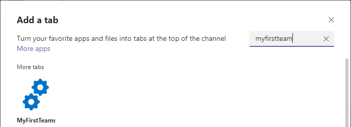
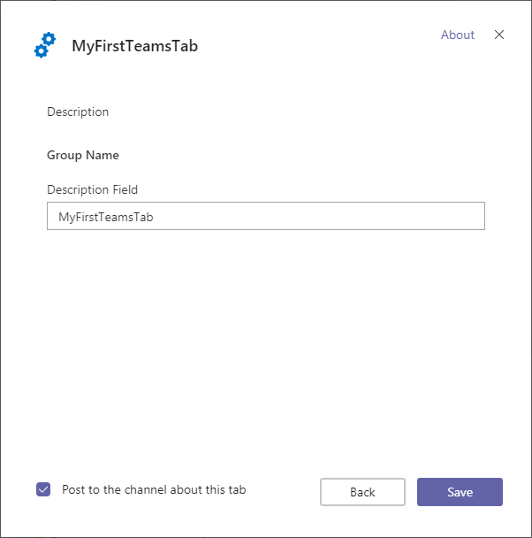

# Building Microsoft Teams Tabs using SharePoint Framework

Starting with SharePoint Framework v1.8, you can build tabs for Microsoft Teams using SharePoint Framework tooling and use SharePoint as a host for your solutions

There are following benefits on using SharePoint Framework as the platform for your Microsoft Teams tabs:

- The development model is similar to SharePoint Framework web parts
- Technically any web part can be exposed as a tab in Microsoft Teams
- You have difference scoping options on exposing your custom tab as a web part and tab in your tenant
- Your tab will be executed in the context of the underlying SharePoint site behind of the specific team. This means that you can take advantage of any SharePoint specific APIs or functionalities in your web part.

## Development process

> [!IMPORTANT]
> You may notice a menu item **Sync to Teams** in the App Catalog ribbon:
>
> 
>
> At this time this functionality is not fully implemented and is not the recommended way to deploy your SharePoint Framework web part to Microsoft Teams as a custom tab. This document will be updated when this functionality has been deployed across SharePoint Online. Until that time, the recommended approach is to install SharePoint Framework web parts as custom Microsoft Teams tabs using the side loading approach. Please refer to [Creating a team manifest manually for a web part](./web-parts/guidance/creating-team-manifest-manually-for-webpart.md) to proceed for now and follow the steps in the 'Alternative deployment options' section of this article.

You can start developing Microsoft Teams tabs simply by using the SharePoint Framework 1.8 or later packages. High level steps to get started are as follows:

> [!NOTE]
> Refer to the detailed steps to get started from the [Building Microsoft Teams tab using SharePoint Framework](web-parts/get-started/using-web-part-as-ms-teams-tab.md) tutorial which contains additional important details you must follow.

1. Create a SharePoint Framework solution with a client-side web part
1. Add `"TeamsTab"` to the `supportedHosts` property of the web part manifest:

    ```json
    "supportedHosts": ["SharePointWebPart", "TeamsTab"],
    ```

1. Deploy the web part using tenant-scoped deployment option to your SharePoint app catalog
1. Create the Microsoft Teams app manifest file, **manifest.json**, and save it in the **./teams** folder of the solution
1. ZIP the contents of the **./teams** folder; this is the Microsoft Teams app package
1. Use the Microsoft Teams app package to side load the application in Microsoft Teams

## Deployment options

There are multiple options to deploy Microsoft Teams tab. As both SharePoint and Microsoft Teams have their own app catalog, deployment requires operations on both services. Visibility of the new functionality can be controlled by the deployment steps taken.

### Tenant deployment

In the future, Microsoft will implement a **Sync with Teams** button in the App Catalog ribbon that will automatically create the Microsoft Teams app manifest, app package and install it in the Microsoft Teams store. This will make your solution available for all users in your tenant and Microsoft Teams teams.

> [IMPORTANT]
> At this time this functionality is not fully implemented and is not the recommended way to deploy your SharePoint Framework web part to Microsoft Teams as a custom tab. This document will be updated when this functionality has been deployed across SharePoint Online. Until that time, the recommended approach is to install SharePoint Framework web parts as custom Microsoft Teams tabs using the side loading approach.

### Alternative deployment options

There is an alternative way to deploy your solution which will for instance allow you to make a solution available only to one specific team in your tenant. Please refer to [Create Microsoft Teams manifest manually for a web part and deploy it to Microsoft Teams](./web-parts/guidance/creating-team-manifest-manually-for-webpart.md) how to create the manifest.

1. Build your SharePoint Framework solution the normal way:

    ```sh
    gulp build
    gulp bundle --ship
    gulp package-solution --ship
    ```

1. Locate the **./teams** folder in your project folder:

    

1. Notice that there are 2 image files in there. Add the manifest file you created as described in [Create Microsoft Teams manifest manually for a web part and deploy it to Microsoft Teams](./web-parts/guidance/creating-team-manifest-manually-for-webpart.md) to this folder and call it ***manifest.json**.
1. After you added the manifest to the **./teams** folder, zip the contents of the folder into a zip file. This means that the zip file should only contain the manifest.json and the 2 images.
1. Add your solution to the app catalog and make sure to select the option **Make this solution available to all sites in the organization** before selecting **Deploy**

### Turn on side loading of external apps in Teams

In order to upload an app for a specific team, you will have to enable side loading. The following configuration steps must be performed only **once** in a tenant.

1. Navigate to the Microsoft 365 Admin center by selecting **Admin** from the app launcher.

    

1. Choose **Settings** and **Services & add-ins** from the left menu

1. Select **Microsoft Teams** from the list of services you want to manage

    

1. Extend the **Apps** section under Tenant-wide settings

    

1. Ensure that **Allow sideloading of external apps** setting is enabled

    

1. Click **Save**.

    > [!NOTE]
    > The side loading configuration to be done only once in a tenant which you are using. More content on preparing your Office 365 tenant for Microsoft Teams development from the [Microsoft Teams developer documentation](https://docs.microsoft.com/en-us/microsoftteams/platform/get-started/get-started-tenant#turn-on-microsoft-teams-for-your-organization).

1. Move to your Microsoft Teams instance by selecting **Teams** in the app launcher.

    

1. Choose a Team which you want to use for testing the capability and select **Manage team** from the `...` menu.

    

1. Move to **Apps** tab

1. Choose **Upload a custom app** from the bottom right corner

    > [!NOTE]
    > If this setting is not available, side loading is not enabled in the tenant which you are using. Double check the settings from the tenant admin UIs.

1. Upload the Microsoft Teams app manifest file your created earlier from the **./teams** folder under your newly created solution and ensure that it's properly visible in the list of Apps. Notice how the custom image is visible with the description of the solution.

    

1. Move to a channel in the Team where you just uploaded the solution. In below picture we have activated the **General** channel in **Team**

    

1. Click `+` to add a new tab on the channel

1. Click your custom Tab called **MyFirstTeamTab** in the list

    

1. Notice how you can parameterize the tab instance based on the exposed properties. Select **Save**

    

See following resources for additional details around the different options in both systems:

- [Upload an app package to Microsoft Teams](https://docs.microsoft.com/en-us/microsoftteams/platform/concepts/apps/apps-upload)
- [Tenant-scoped solution deployment for SharePoint Framework solutions](https://docs.microsoft.com/en-us/sharepoint/dev/spfx/tenant-scoped-deployment)

## Detecting if web part is in Teams context

Page context in a web part has by default a reference to the Teams JavaScript SDK, so that you can easily get access on the Teams context when your web part is rendered as a tab.

```javascript
this.context.microsoftTeams
```

> [!NOTE]
> See more information around th Microsoft Teams tab context from the [Microsoft Teams development documentation](https://docs.microsoft.com/en-us/microsoftteams/platform/concepts/tabs/tabs-context?view=msteams-client-js-latest).

## See also

- [Building Microsoft Teams tab using SharePoint Framework - Tutorial](web-parts/get-started/using-web-part-as-ms-teams-tab.md)
