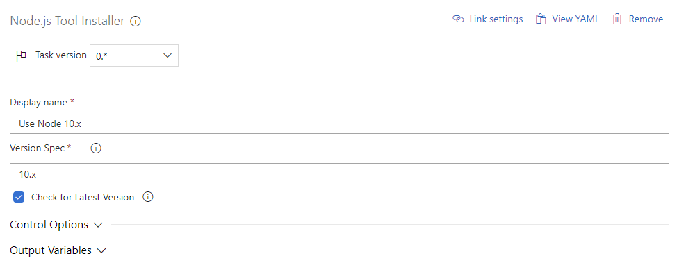
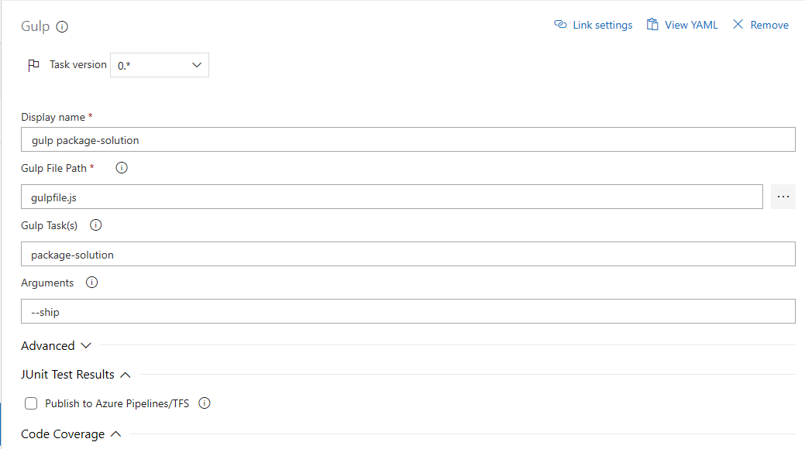
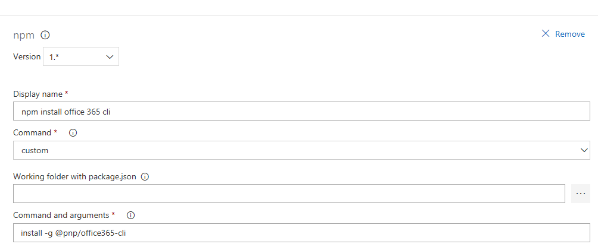
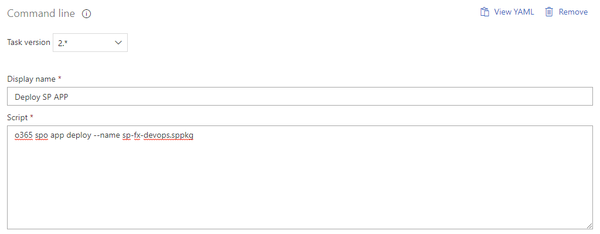

# Implement Continuous Integration and Continuous deployment using Azure DevOps

Azure DevOps (Visual Studio Team Services / Team Foundation Server) consists of a set of tools and services that help developers implement DevOps, Continuous Integration, and Continuous Deployment processes for their development projects.

This article explains the steps involved in setting up your Azure DevOps environment with Continuous Integration and Continuous Deployment to automate your SharePoint Framework builds, unit tests, and deployment.

## Chosing between Azure Multi-stage Pipelines (preview) and Azure DevOps builds and releases

There are currently two approaches available to implement continuous integration, and deployement in Azure DevOps.  
Azure builds and releases is the historic one, featuring a graphical edition experience and storing the definitions in a JSON document hidden from the user.  
Azure multi-stage Pipelines is a newer feature still in preview, is relies on pipeline definitions stored as YAML files on the repository providing transparency, version history and repeatability.  
Both approaches are decribed for the SharePoint Framework:

- [Azure Build and Release](./implement-ci-cd-with-azure-pipelines.md)
- Azure Multi-stage Pipelines (this article)


## Continuous Integration

Continuous Integration (CI) helps developers integrate code into a shared repository by automatically verifying the build using unit tests and packaging the solution each time new code changes are submitted.  

Setting up Azure DevOps for Continuous Integration with a SharePoint Framework solution requires the following steps:

1. Creating the Build Definition
1. Installing NodeJS
1. Restoring dependencies
1. Executing Unit Tests
1. Importing test results
1. Importing code coverage information
1. Bundling the solution
1. Packaging the solution
1. Preparing the artifacts
1. Publishing the artifacts

### Creating the Build Definition

The Build Definition, as its name suggests, includes all the definitions and their configurations for the build.  Start setting up your Continuous Integration by creating a new build definition and link it to your repository.


> [!NOTE] 
> Build definitions can be described as a process template. It is a set of configured tasks that will be executed one after another on the source code every time a build is triggered. Tasks can be grouped in phases, by default a build definition contains at least one phase. You can add new tasks to the phase by clicking on the big plus sign next to the phase name.

### Installing NodeJS version 10

Once the Build Definition has been created, the first thing you need to do is install NodeJS.  Make sure to install version 10, as SharePoint Framework depends on it.


> [!NOTE] 
> Make sure you specify `10.x` in the `Version Spec` field. If your project is based on SharePoint Framework 1.7.1 or earlier, use version 8.x.

### Restoring dependencies

Because third party dependencies are not stored in the source control, you need to restore those before starting to build the project. To do so add a `npm` task and set the command to `install`.


### Executing Unit Tests

The SharePoint Framework does not provide a testing framework by default (since 1.8.0), we will leverage Jest with this sample. These modules will be installed in a later step and it is highly recommended at a minimum to test the business logic of your code to get feedback on any potential issues or regressions as soon as possible. To have Azure DevOps execute your unit tests, add a `npm` task. Set the `command` to `custom` and `custom command` field, enter `test`. Then set the `Working Directory` option to `$(Build.SourcesDirectory)`.


#### Configuring Jest

By default SharePoint Framework projects does not include a testing Framework. We will leverage Jest in this sample.

```shell
npm i jest jest-junit @voitanos/jest-preset-spfx-react16 -D
```

> [!NOTE] 
> Projects generated on SharePoint Framework 1.7.1 and earlier rely on React version 15. If you are using React 15, you need to install @voitanos/jest-preset-spfx-react15 instead. For other Frameworks (Knockout, ...) you might need to install a different preset instead. 

You also need to configure Jest, to do so create a file `config/jest.config.json` and add the following content.

```JSON
{
  "preset": "@voitanos/jest-preset-spfx-react16",
  "rootDir": "../src",
  "coverageReporters": [
    "text",
    "json",
    "lcov",
    "text-summary",
    "cobertura"
  ],
  "reporters": [
    "default",
    ["jest-junit", {
      "suiteName": "jest tests",
      "outputDirectory": "temp/test/junit",
      "outputName": "junit.xml"
    }]
  ]
}
```

You also need to configure your project to leverage jest when typing commands. To do so edit the `package.json` file and add/replace these two `scripts` with the following values:

```JSON
    "test": "./node_modules/.bin/jest --config ./config/jest.config.json",
    "test:watch": "./node_modules/.bin/jest --config ./config/jest.config.json --watchAll"
```

#### Writing a unit test

To write your first unit test, create a new file `src/webparts/webPartName/tests/webPartName.spec.ts` and add the following content:

```TS
import 'jest'

describe("webPartName", () => {
  test("should add numbers Sync fluent", () => {
    const result = 1 + 3;
    expect(result).toBe(4); // fluent API
  });
});
```

> [!NOTE] 
> You can learn more about writing unit tests using Jest [here](https://jestjs.io/docs/en/getting-started.html). You can learn more about testing react applications with Jest and Enzyme [here](https://jestjs.io/docs/en/tutorial-react) (you can ignore the setup part).

### Importing test results

In order to get test results information attached with the build results, you need to import these test results from the test runner into Azure DevOps. To do so, add a new `Publish Test Results` task. Set the `Test results files` field to `**/junit.xml` and the `Search folder` to `$(Build.SourcesDirectory)`.  


### Importing code coverage information

In order to get code coverage reported with the build status you need to add a task to import that information. To configure the code coverage information, add the `publish code coverage results` tasks. Make sure you set the tool to `Cobertura`, `Summary files` to `$(Build.SourcesDirectory)/**/*-coverage.xml`.


### Bundling the solution

You first need to bundle your solution in order to get static assets that can be understood by a web browser.  Add another `gulp` task, set the `gulpfile` path, set the `Gulp Tasks` field to bundle and add `--ship` in the `Arguments`.


### Packaging the solution

Now that you have static assets, the next step is to combine the assets into a package SharePoint will be able to deploy. Add another `gulp` task, set the `gulpfile` path, set the `Gulp Tasks` field to `package-solution` and add `--ship` in the `Arguments`.



### Preparing the artifacts

By default, an Azure DevOps build does not retain any files.  To ensure that the required files needed for the release are retained, you need to explicitly indicate which files should be kept.  
Add a `Copy Files` task and set the `Contents` to `**\*.sppkg` (the SharePoint Package created with the previous task) and the target folder to `$(build.artifactstagingdirectory)/drop`.


### Publishing the artifacts

Now that you have collected all the files needed for deployment in a special artifacts folder, you still need to instruct Azure DevOps to keep these files after the execution of the build. To do so add a `Publish artifacts` task and set the `Path to publish` to `$(build.artifactstagingdirectory)/drop` and the `Artifact name` to `drop`.


## Continuous Deployment

Continuous Deployment (CD) takes validated code packages from build process and deploys them into a staging or production environment.  Developers can track which deployments were successful or not and narrow down issues to specific package versions.    

Setting up Azure DevOps for Continuous Deployments with a SharePoint Framework solution requires the following steps:

1. Creating the Release Definition
1. Linking the Build Artifact
1. Creating the Environment
1. Installing NodeJS
1. Installing the Office 365 CLI
1. Connecting to the App Catalog
1. Adding the Solution Package to the App Catalog
1. Deploying the Application
1. Setting the Variables for the Environment

### Creating the Release Definition

Start by creating a new Release Definition with an empty template. A Release Definition is a process that is used to identify the following elements for the deployment:

- Environment
- Deployment tasks
- Build artifacts


### Linking the Build Artifact

Click on `Add an artifact` and select the build definition you previously created.  Write down the `Source Alias` name you set, as you will need to use it in subsequent tasks.


### Creating the Environment

When you create your continuous deployment environment, you can give a name and configure pre-deployment approvals, artifact filters (i.e. deploy only if the build comes from this or that branch), and much more by clicking on the buttons around the environment box or directly on the title.


### Installing NodeJS

By click on `1 job, 0 tasks` you can access the tasks configuration view, which works similarly to the build definition. Here, you can select the set of tasks that will run only for this specific environment.  This includes installing NodeJS version 10 or later.
Add a `Node tool installer` task and define `10.X` in the `Version Spec` field. If your project is based on SharePoint Framework version 1.7.1 or earlier, use version 8.X.


### Installing the Office 365 CLI

The Office 365 Common Language Interface (CLI) is an open source project built by the OfficeDev PnP Community. In order to leverage the  CLI as part of your Release Definition, you first need to install it.  Then, you will be able to take advantage of commands available  to handle deployment. Add a `npm` task, select a `Custom` command and type `install -g @pnp/office365-cli` in the `Command and Arguments` field.



> [!NOTE] 
> Learn more about the [Office 365 CLI](https://pnp.github.io/office365-cli/)

### Connecting to SharePoint Online

Before using the App Catalog in your deployment environment, you first need to authenticate against the App Catalog of your tenant.  To do so, add a `Command Line` task and paste in the following command into the `script` field `o365 login -t password -u $(username) -p $(password)`.


> [!NOTE] 
> If you are using Office CLI to connect to your tenant for the first time, you need to perform an interactive logon with the account first. This is required to grant access to PnP Office 365 Management Shell application which is used by Office CLI to access your tenant on the account's behalf. Your task will otherwise fail to logon non-interactively. Details available on Office 365 CLI [User Guide](https://pnp.github.io/office365-cli/user-guide/connecting-office-365/).

> [!NOTE]
> Office 365 CLI is an open-source tool with active community providing support for it. There is no SLA for the open-source tool support from Microsoft.

### Adding the Solution Package to the App Catalog

Upload the solution package to your App Catalog by adding another `Command Line` task and pasting the following command line in the `Script` field `o365 spo app add -p $(System.DefaultWorkingDirectory)/SpFxDevOps/drop/SharePoint/solution/sp-fx-devops.sppkg --overwrite`

> [!NOTE] 
> The path of the package depends on your solution name (see your project configuration) as well as the `Source Alias` you defined earlier, make sure they match.

> [!NOTE] 
> You can upload a solution to a site collection app catalog by adding `--appCatalogUrl https://$(tenant).sharepoint.com/$(catalogsite) --scope site`


### Deploying the Application

The final step in the setup is to deploy the application to the App Catalog to make it available to all site collections within the tenant as its latest version. Add another `Command Line` task and paste the following command line in the `Script` field `o365 spo app deploy --name sp-fx-devops.sppkg`

> [!NOTE] 
> Make sure you update the package name.

> [!NOTE] 
> You can deploy a solution from a site collection app catalog by adding `--appCatalogUrl https://$(tenant).sharepoint.com/$(catalogsite) --scope site`



### Setting the Variables for the Environment

The tasks you configured in the last step rely on Azure DevOps process variables (easily identified with the `$(variableName)` syntax). You need to define those variables before being able to run the build definition. To do so, click on the `Variables` tab.  
Add the following variables

| Name | Value |
| ------ | ------ |
| catalogsite | Optional. Server relative Path of the App Catalog Site eg `sites/appcatalog` when uploading to a [site collection App Catalog](../../general-development/site-collection-app-catalog.md) |
| password | Password of the user with administrative permissions on the tenant, do not forget to check the lockpad to mask it to other users |
| username | Username of the user with administrative permissions on the tenant |
| tenant | Optional. Tenant name in https://tenant.sharepoint.com eg `tenant` when uploading to a site collection App Catalog |

  

> [!NOTE]
> Make sure you save your release definition.

## Testing

To test your newly created Continuous Deployment process, return to the `Builds` section in Azure DevOps, select your build definition and click on `Queue`. Select your branch and click on `Queue`. A new build will be created and will start building. 


After a couple of minutes, your build should complete and show a result page like this one.  


If you navigate to the `Release` section of Azure DevOps, a new release should have started automatically. After a few minutes your release should complete, and your SharePoint Framework solution is deployed to your tenant.  


Your DevOps pipeline for your SharePoint Framework solution in Azure DevOps is now set up and ready to be customized further to your scenario.

## See Also

- [SharePoint Framework Overview](../sharepoint-framework-overview.md)
- [Sample Project on GitHub](https://github.com/SharePoint/sp-dev-build-extensions/tree/master/samples/azure-devops-ci-cd-spfx)
- [Integrate Gulp Tasks in the build pipeline](./integrate-gulp-tasks-in-build-pipeline.md)
